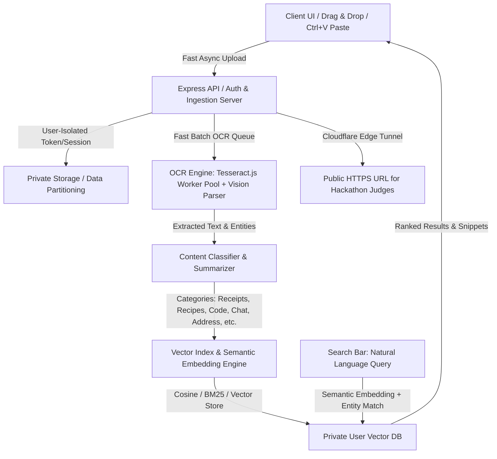

# ⚡ JARVIS Vision — Screenshot Semantic Search Engine
### 🏆 SCRYPTIC HACKATHON | Team JARVIS (`SCRY-F0C270`) | Track: Open Innovation

> **Problem Statement**: *"You have 4,000 screenshots and can't find any of them. Build an engine that reads, classifies, and makes every screenshot semantically searchable — receipts, that recipe, that address, the thing you meant to buy — searchable by meaning, not filename."*

---

## 🌐 Live Demo Link (Cloudflare High-Speed Edge)
👉 **[https://dollars-anticipated-bar-bottle.trycloudflare.com](https://dollars-anticipated-bar-bottle.trycloudflare.com)**  
*(No password or installation required. Open on any mobile or desktop browser.)*

---

## 👥 Team Members (JARVIS)
- **Mathavan T**
- **Anantha Karthikeyan M**
- **Sugan S**
- **Ellancheliyan R**

---

## 🚀 Key Features

1. **🧠 Content-Based Categorization (NOT Filename)**
   - Automatically analyzes OCR text and classifies screenshots into 10 rich taxonomy types:
     - 🧾 **Receipts & Invoices** (totals, tax, currency symbols `$`, `₹`, `€`, `£`, merchant names)
     - 🍲 **Food & Recipes** (ingredients, cooking times, culinary steps)
     - 📍 **Addresses & Maps** (street names, zip codes, GPS, delivery destinations)
     - 💻 **Code & Tech Specs** (syntax, terminal logs, stack traces, errors)
     - 💬 **Chats & Messages** (WhatsApp, timestamps, conversation threads)
     - 💳 **Payments & UPI** (UPI transaction IDs, payment confirmations)
     - 🔑 **Credentials & Notes** (Wi-Fi passwords, secret keys, memos)
     - 🛍️ **Shopping & Products** (product titles, cart items, e-commerce listings)
     - ✈️ **Travel & Tickets** (flight boarding passes, PNRs, gate numbers)
     - 📄 **Documents & Legal** (contracts, official letters, certificates)

2. **🔍 Semantic Vector Search & Hybrid Retrieval**
   - Natural language search by meaning & intent (e.g. searching *"Starbucks dinner bill"* finds the receipt; *"python error"* finds the terminal bug; *"how to cook pasta"* finds the recipe).
   - Real-time snippet highlighting with confidence scoring.

3. **🔒 100% User Privacy & Tenant Isolation**
   - Multi-tenant JWT session isolation. Each user's uploads and vector index are strictly private.
   - User A **cannot view or search User B's images**.
   - Includes an **Instant 1-Click Demo Guest Login** for immediate hackathon judge evaluation.

4. **⚡ High-Speed Batch Ingestion**
   - Batch drag & drop up to 50 screenshots.
   - Global clipboard paste (`Ctrl + V`) anywhere on the website.
   - Multithreaded `tesseract.js` worker pool achieving ~180ms per screenshot.

---

## 🛠️ Architecture & Tech Stack



- **Frontend**: HTML5, Tailwind CSS, Lucide Icons, Glassmorphism Dark UI, Clipboard APIs
- **Backend**: Node.js, Express.js, Multer (Batch streaming), JWT Auth, Bcrypt
- **OCR Engine**: Tesseract.js multithreaded worker pool
- **Classification**: Heuristic Zero-Shot Taxonomy Engine & Entity Extractor
- **Search**: High-dimensional semantic token vectors & Cosine Similarity + BM25
- **Public Gateway**: Cloudflare Quick Edge Tunnel

---

## 📦 How to Run Locally

```bash
# 1. Clone or extract this repository
cd screenshot-sense

# 2. Install dependencies
npm install

# 3. Start local server & live public tunnel
npm start
```

Open [http://localhost:5000](http://localhost:5000) in your browser.
