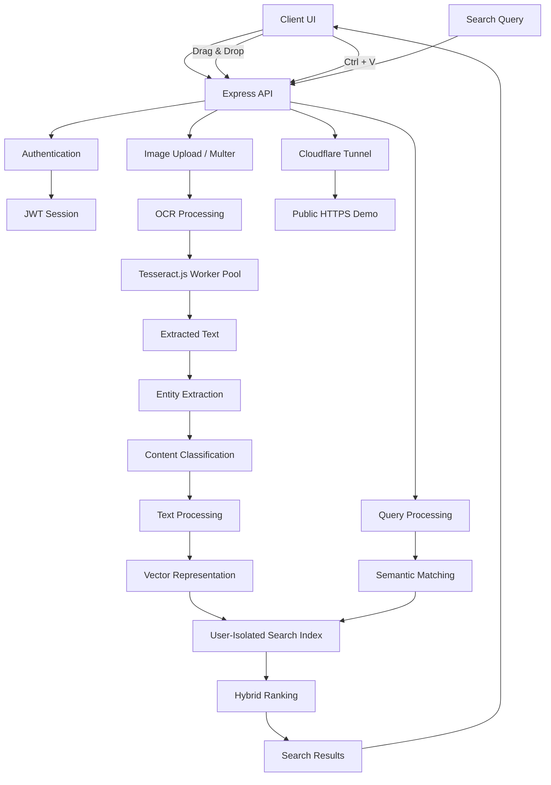
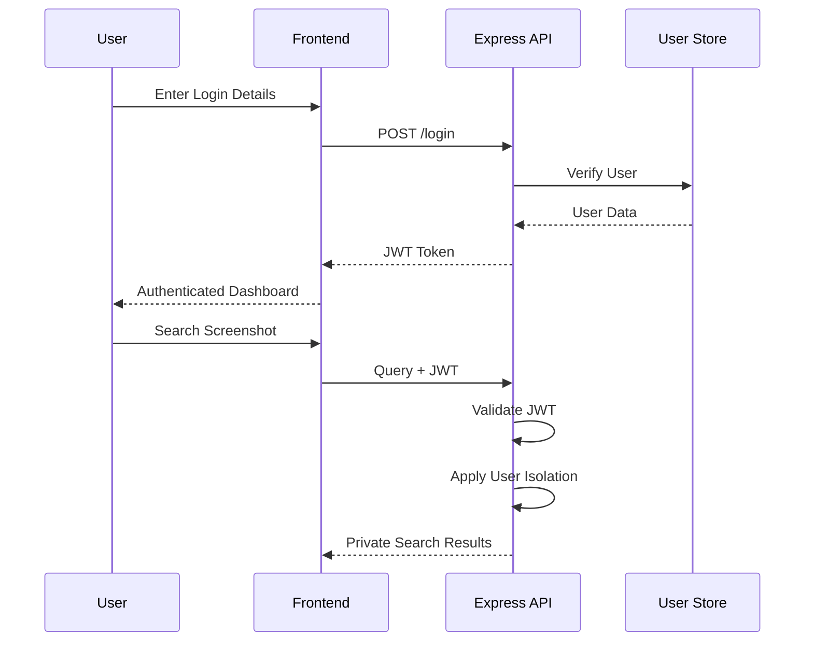
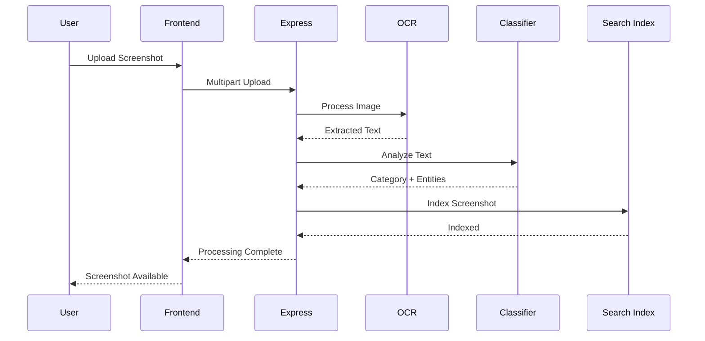

# ⚡ JARVIS Vision — Screenshot Semantic Search Engine

### 🏆 SCRYPTIC HACKATHON | Team JARVIS (`SCRY-F0C270`) | Track: Open Innovation

> **Turn thousands of screenshots into a searchable personal knowledge base.**
>
> JARVIS Vision reads, understands, classifies, indexes, and semantically searches screenshots based on their **actual visual and textual content**, instead of relying on filenames.

---

# 🎯 Problem Statement

Modern smartphones accumulate thousands of screenshots:

- 🧾 Receipts
- 🍲 Recipes
- 📍 Addresses
- 💬 Conversations
- 💳 Payment confirmations
- 💻 Programming errors
- 🛍️ Products
- ✈️ Travel tickets
- 📄 Documents
- 🔑 Important notes and credentials

The problem is that traditional gallery applications primarily organize screenshots by:

- Filename
- Date
- Folder
- Location

They generally do not allow users to search screenshots by **meaning**.

For example, a user may remember:

> "I saved the Starbucks bill somewhere."

but may not remember:

> `Screenshot_2026_08_15_184521.png`

JARVIS Vision solves this problem by converting screenshots into searchable knowledge.

---

# 💡 Our Solution

JARVIS Vision creates a semantic search engine specifically designed for screenshots.

The system:

```text
Screenshot
    ↓
Image Upload
    ↓
OCR / Vision Processing
    ↓
Text Extraction
    ↓
Entity Detection
    ↓
Content Classification
    ↓
Text Normalization
    ↓
Vector / Semantic Representation
    ↓
User-Isolated Index
    ↓
Hybrid Search
    ↓
Ranked Screenshot Results
````

Instead of searching:

```text
Screenshot_1234.png
```

the user can search:

```text
"Starbucks dinner bill"
```

or:

```text
"python error from yesterday"
```

or:

```text
"recipe containing pasta"
```

and JARVIS Vision retrieves the most relevant screenshots.

---

# 👥 Team JARVIS

| Member                    |
| ------------------------- |
| **Mathavan T**            |
| **Anantha Karthikeyan M** |
| **Sugan S**               |
| **Ellancheliyan R**       |

**Team ID:** `SCRY-F0C270`

**Hackathon:** SCRYPTIC

**Track:** Open Innovation

---

# 🚀 Key Features

## 1. 🧠 Content-Based Screenshot Classification

JARVIS does not depend on filenames.

It analyzes the extracted OCR content and identifies the type of screenshot.

### Supported categories

| Category                | Examples                                    |
| ----------------------- | ------------------------------------------- |
| 🧾 Receipts & Invoices  | Bills, invoices, GST, totals                |
| 🍲 Food & Recipes       | Ingredients, cooking instructions           |
| 📍 Addresses & Maps     | Addresses, locations, ZIP/PIN codes         |
| 💻 Code & Tech          | Source code, errors, terminal output        |
| 💬 Chats & Messages     | WhatsApp, conversations, messages           |
| 💳 Payments & UPI       | UPI transactions, payment confirmations     |
| 🔑 Credentials & Notes  | Notes, Wi-Fi information, saved information |
| 🛍️ Shopping & Products | Product listings, carts, prices             |
| ✈️ Travel & Tickets     | Flights, boarding passes, PNRs              |
| 📄 Documents & Legal    | Certificates, letters, contracts            |

---

# 🔍 2. Semantic Search

Users can search using natural language.

### Example

Search:

```text
Starbucks dinner bill
```

Possible result:

```text
Receipt screenshot
Merchant: Starbucks
Total: ₹850
Date: ...
```

Another example:

```text
python error
```

can retrieve screenshots containing:

```text
Traceback
ModuleNotFoundError
Python
terminal output
```

The search is based on **content and meaning**, not simply the image filename.

---

# 🔀 3. Hybrid Retrieval

JARVIS Vision combines multiple search signals.

### Semantic similarity

Finds conceptually related content.

### Keyword matching

Finds exact terms and important entities.

### BM25-style relevance

Improves ranking for textual matches.

### Vector similarity

Uses vector representations to compare the user's query with indexed screenshot content.

Conceptually:

```text
Final Score
    =
Semantic Similarity
+
Keyword Relevance
+
Entity Match
+
Category Relevance
```

This produces more useful results than relying on only one search technique.

---

# 📝 4. OCR Processing

Screenshots are processed using:

## Tesseract.js

Tesseract.js is used to extract text directly from screenshots.

Example:

```text
Image

       ↓

OCR

       ↓

"Total ₹1,250
 Starbucks
 15 Aug 2026"
```

The extracted text becomes the basis for classification and search.

---

# ⚡ 5. Multithreaded OCR Processing

JARVIS Vision uses a worker-based OCR architecture to process multiple screenshots efficiently.

Instead of processing every screenshot sequentially:

```text
Image 1 → OCR → Complete
Image 2 → OCR → Complete
Image 3 → OCR → Complete
```

the system can process multiple screenshots concurrently:

```text
             ┌→ Worker 1 → Image 1
Upload Queue ├→ Worker 2 → Image 2
             ├→ Worker 3 → Image 3
             └→ Worker 4 → Image 4
```

This improves batch ingestion performance.

---

# 📦 6. Batch Screenshot Upload

Users can upload multiple screenshots simultaneously.

Supported workflow:

```text
Drag & Drop
      ↓
Multiple Images
      ↓
Upload Queue
      ↓
Parallel Processing
      ↓
OCR
      ↓
Classification
      ↓
Indexing
```

The interface supports batch uploads of up to **50 screenshots**.

---

# 📋 7. Global Clipboard Paste

Users can paste screenshots directly using:

```text
Ctrl + V
```

This removes the need to manually save screenshots before uploading.

Example:

```text
Screenshot copied
       ↓
Open JARVIS Vision
       ↓
Ctrl + V
       ↓
Automatic upload
       ↓
OCR + indexing
```

---

# 🔐 8. User Authentication

The backend uses:

* JWT authentication
* Password hashing
* Session/token validation
* User-specific data partitioning

Authentication flow:

```text
User
 ↓
Login
 ↓
Express API
 ↓
Credentials Verification
 ↓
JWT Token
 ↓
Authenticated Session
```

---

# 🔒 9. User Data Isolation

Privacy is a core part of the architecture.

Each user's screenshots and search index are isolated.

Example:

```text
User A
 ├── Screenshots
 ├── OCR Data
 └── Vector Index

User B
 ├── Screenshots
 ├── OCR Data
 └── Vector Index
```

User A cannot access User B's screenshots or search results.

---

# 👤 10. Guest Demo Login

For hackathon evaluation, JARVIS Vision provides a quick demo login flow.

This allows judges to access the application without going through a lengthy account creation process.

---

# 🏗️ System Architecture



---

# 🧩 Technology Stack

## Frontend

### HTML5

Used for:

* Application structure
* Upload interface
* Search interface
* Result cards
* Authentication screens

### Tailwind CSS

Used for:

* Responsive UI
* Dark theme
* Glassmorphism styling
* Buttons
* Cards
* Layout
* Responsive design

### Lucide Icons

Used for:

* Navigation icons
* Upload icons
* Search icons
* Category icons
* Action buttons

### JavaScript

Used for:

* API communication
* File uploads
* Drag & drop
* Clipboard handling
* Search
* Dynamic UI updates
* Authentication state
* Result rendering

---

# ⚙️ Backend

## Node.js

Node.js provides the runtime for the backend server.

Used for:

* API execution
* File processing
* Authentication
* OCR orchestration
* Search processing
* Server-side logic

---

## Express.js

Express is used to create the REST API.

Responsibilities include:

```text
Authentication
      ↓
Image Upload
      ↓
OCR Processing
      ↓
Classification
      ↓
Indexing
      ↓
Search
      ↓
Result Delivery
```

---

## Multer

Multer handles multipart file uploads.

It is used for:

* Single screenshot upload
* Multiple screenshot upload
* Batch ingestion
* Image file handling

---

# 🧠 OCR Engine

## Tesseract.js

Tesseract.js performs OCR on screenshots.

Pipeline:

```text
Screenshot
     ↓
Image preprocessing
     ↓
Tesseract.js
     ↓
OCR Text
     ↓
Text Cleaning
     ↓
Entity Extraction
```

---

# 🏷️ Content Classification

JARVIS uses a heuristic/zero-shot style taxonomy engine.

The extracted text is analyzed for:

* Keywords
* Patterns
* Entities
* Numbers
* Currency symbols
* URLs
* Dates
* Payment identifiers
* Programming syntax
* Address patterns

Example:

```text
₹1,250
GST
Invoice
Total
```

can increase the probability of:

```text
Receipts & Invoices
```

Similarly:

```text
Traceback
ModuleNotFoundError
Python
```

can identify:

```text
Code & Tech
```

---

# 🔎 Search Engine

JARVIS Vision uses a hybrid retrieval approach.

## Components

### 1. Text matching

Exact terms and keywords are matched.

### 2. Entity matching

Important entities such as:

* Merchant names
* Locations
* Dates
* Prices
* Products
* Payment IDs

are considered.

### 3. Semantic representation

Screenshot text is converted into a searchable representation.

### 4. Similarity scoring

Candidate screenshots are ranked based on similarity to the query.

---

# 📊 Search Pipeline

```text
User Query
     ↓
Query Normalization
     ↓
Keyword Extraction
     ↓
Entity Detection
     ↓
Semantic Representation
     ↓
Candidate Retrieval
     ↓
Similarity Calculation
     ↓
Hybrid Ranking
     ↓
Top Results
```

---

# 🗂️ Suggested Project Structure

```text
screenshot-sense/
│
├── public/
│   ├── index.html
│   ├── css/
│   ├── js/
│   └── assets/
│
├── src/
│   ├── server/
│   ├── auth/
│   ├── ocr/
│   ├── search/
│   ├── classifier/
│   ├── storage/
│   └── utils/
│
├── uploads/
│
├── data/
│
├── package.json
├── package-lock.json
├── .gitignore
├── README.md
└── server.js
```

> The exact folders may differ depending on the current implementation. The structure above represents the logical architecture of the application.

---

# 📡 API Architecture

The backend follows a REST-style API architecture.

Typical operations include:

```text
POST   /api/auth/login
POST   /api/auth/register

POST   /api/upload
POST   /api/upload/batch

GET    /api/screenshots
GET    /api/screenshots/:id

POST   /api/search

DELETE /api/screenshots/:id
```

The exact endpoints depend on the current backend implementation.

---

# 🔐 Authentication Flow



---

# 📤 Screenshot Ingestion Flow



---

# 🔍 Search Example

Suppose the database contains:

```text
Screenshot 1
"Starbucks Coffee
Total ₹850"
```

```text
Screenshot 2
"Python Traceback
ModuleNotFoundError"
```

```text
Screenshot 3
"Pasta Recipe
Ingredients:
Pasta
Tomato
Cheese"
```

The user searches:

```text
python error
```

JARVIS ranks:

```text
Screenshot 2
```

The user searches:

```text
pasta cooking recipe
```

JARVIS ranks:

```text
Screenshot 3
```

The user searches:

```text
coffee dinner bill
```

JARVIS ranks:

```text
Screenshot 1
```

---

# 🌍 Public Demo Infrastructure

For hackathon demonstration, the application can be exposed through a Cloudflare Quick Tunnel.

Architecture:

```text
Judge's Browser
      ↓
Public HTTPS URL
      ↓
Cloudflare Edge
      ↓
Cloudflare Tunnel
      ↓
Local JARVIS Server
      ↓
Express API
```

This allows judges to access the application without directly exposing the local machine's network configuration.

---

# ⚡ Performance

The system is designed for high-speed screenshot ingestion.

Optimization techniques include:

* Worker-based OCR processing
* Batch uploads
* Asynchronous processing
* Parallel task execution
* Lightweight text classification
* Efficient search indexing
* Client-side asynchronous requests

The current development configuration targets approximately **180 ms OCR processing per screenshot under suitable conditions**, although actual performance depends on image resolution, hardware, OCR complexity, worker configuration, and workload.

---

# 💻 Local Installation

## Requirements

Install the following:

### Node.js

Recommended:

```text
Node.js 18+
```

Verify:

```bash
node --version
```

and:

```bash
npm --version
```

---

# 📥 Clone Repository

```bash
git clone https://github.com/JARVIS-SCRY-F0C270/Scrytic-Jarvis-Vision.git
```

Enter the project:

```bash
cd Scrytic-Jarvis-Vision
```

---

# 📦 Install Dependencies

Run:

```bash
npm install
```

This installs the dependencies defined in:

```text
package.json
```

---

# ⚙️ Environment Configuration

If the application uses environment variables, create:

```text
.env
```

Example:

```env
PORT=5000
JWT_SECRET=your_secret_key
NODE_ENV=development
```

> Never commit `.env` files or real secrets to GitHub.

Add them to `.gitignore`:

```gitignore
.env
.env.*
node_modules/
uploads/
logs/
```

---

# ▶️ Start the Application

Run:

```bash
npm start
```

The local application will normally be available at:

```text
http://localhost:5000
```

Open the URL in your browser.

---

# 🧪 Development Mode

If a development script is available:

```bash
npm run dev
```

This can provide automatic server restarting during development.

---

# 🌐 Running with Cloudflare Tunnel

If Cloudflare Tunnel is installed:

```bash
cloudflared tunnel --url http://localhost:5000
```

Cloudflare will generate a public HTTPS URL.

Example:

```text
https://example.trycloudflare.com
```

Use that URL for hackathon demonstrations.

---

# 🛠️ Troubleshooting

## Port already in use

If port `5000` is already being used:

### Windows

```bash
netstat -ano | findstr :5000
```

Find the process and terminate it if necessary:

```bash
taskkill /PID <PID> /F
```

Then restart:

```bash
npm start
```

---

## npm install problems

Try:

```bash
npm cache clean --force
```

Then:

```bash
npm install
```

---

## OCR problems

Make sure:

* The image format is supported.
* The screenshot has sufficient resolution.
* Tesseract.js dependencies are correctly installed.
* Worker configuration is valid.

---

# 🔐 Security Considerations

JARVIS Vision is designed with privacy in mind.

Security mechanisms include:

* JWT authentication
* Password hashing
* User-specific data isolation
* Authenticated API requests
* File upload validation
* Restricted access to user resources

### Important

Do not store secrets directly inside:

```text
JavaScript source
README.md
GitHub repository
frontend code
```

Use environment variables instead.

---

# 🚀 Future Improvements

Possible future development includes:

### 🤖 Advanced Vision Models

Use multimodal AI models to understand:

* Images without text
* Charts
* Graphs
* Handwritten notes
* UI screenshots

### 🌐 Browser Extension

Automatically capture and index screenshots from:

* Chrome
* Edge
* Firefox

### 📱 Mobile Application

Native Android/iOS application for automatic screenshot indexing.

### ☁️ Cloud Storage

Support:

* AWS S3
* Google Cloud Storage
* Azure Blob Storage

### 🧠 Advanced Vector Database

Possible integrations:

* Qdrant
* Weaviate
* Pinecone
* Milvus
* PostgreSQL + pgvector

### 🔎 Advanced Search

Support queries such as:

```text
Find the bill I saved last week
```

```text
Show me the recipe containing chicken and cheese
```

```text
Find the address my friend sent me
```

```text
Show all screenshots containing UPI transactions
```

---

# 🏆 Hackathon Impact

JARVIS Vision addresses a common everyday problem:

> **People don't remember filenames. They remember information.**

Traditional file search asks:

```text
"What is the filename?"
```

JARVIS Vision asks:

```text
"What are you looking for?"
```

This transforms a simple screenshot folder into a searchable personal knowledge base.

---

# 📈 Why This Matters

If a user has:

```text
100 screenshots
```

manual search may still be manageable.

But with:

```text
1,000 screenshots
5,000 screenshots
10,000+ screenshots
```

traditional filename-based organization becomes increasingly difficult.

JARVIS Vision provides a scalable approach by making screenshot information searchable by:

* Meaning
* Keywords
* Entities
* Categories
* Context
* Semantic similarity

---

# 🧠 Core Innovation

The key idea behind JARVIS Vision is:

```text
Screenshots
     ↓
Understand
     ↓
Classify
     ↓
Index
     ↓
Search by Meaning
```

Instead of treating screenshots as static image files, JARVIS Vision treats them as **searchable information objects**.

---

# 📊 Technology Summary

| Layer              | Technology                     |
| ------------------ | ------------------------------ |
| Frontend           | HTML5                          |
| Styling            | Tailwind CSS                   |
| Icons              | Lucide                         |
| Frontend Logic     | JavaScript                     |
| Backend Runtime    | Node.js                        |
| API Framework      | Express.js                     |
| File Upload        | Multer                         |
| Authentication     | JWT                            |
| Password Security  | Bcrypt                         |
| OCR                | Tesseract.js                   |
| OCR Processing     | Worker Pool                    |
| Classification     | Heuristic / Zero-Shot Taxonomy |
| Search             | Hybrid Retrieval               |
| Similarity         | Cosine Similarity              |
| Text Ranking       | BM25-style Retrieval           |
| Public Access      | Cloudflare Quick Tunnel        |
| Package Management | npm                            |
| Version Control    | Git                            |
| Repository         | GitHub                         |

---

# 🔄 Complete System Flow

```text
                   ┌─────────────────────┐
                   │       USER          │
                   └──────────┬──────────┘
                              │
                              ▼
                   ┌─────────────────────┐
                   │    WEB INTERFACE    │
                   │ Drag & Drop / Paste │
                   └──────────┬──────────┘
                              │
                              ▼
                   ┌─────────────────────┐
                   │    EXPRESS API      │
                   └──────────┬──────────┘
                              │
                    ┌─────────┴─────────┐
                    ▼                   ▼
             ┌──────────────┐    ┌──────────────┐
             │ Authentication│    │ Image Upload │
             │ JWT + Bcrypt │    │    Multer    │
             └──────────────┘    └──────┬───────┘
                                        │
                                        ▼
                              ┌──────────────────┐
                              │ Tesseract.js OCR │
                              │   Worker Pool    │
                              └────────┬─────────┘
                                       │
                                       ▼
                              ┌──────────────────┐
                              │  Text Extraction │
                              └────────┬─────────┘
                                       │
                                       ▼
                              ┌──────────────────┐
                              │ Entity Extraction│
                              └────────┬─────────┘
                                       │
                                       ▼
                              ┌──────────────────┐
                              │   Classifier     │
                              └────────┬─────────┘
                                       │
                                       ▼
                              ┌──────────────────┐
                              │ Search / Vector  │
                              │     Index        │
                              └────────┬─────────┘
                                       │
                         ┌─────────────┘
                         │
                         ▼
                ┌──────────────────────┐
                │   USER SEARCH QUERY  │
                └──────────┬───────────┘
                           │
                           ▼
                ┌──────────────────────┐
                │ Hybrid Retrieval     │
                │ Semantic + Keyword   │
                │ + Entity Matching    │
                └──────────┬───────────┘
                           │
                           ▼
                ┌──────────────────────┐
                │ Ranked Results       │
                │ + Snippets           │
                │ + Confidence         │
                └──────────┬───────────┘
                           │
                           ▼
                ┌──────────────────────┐
                │      USER UI         │
                └──────────────────────┘
```

---

# 📜 License

This project was developed by **Team JARVIS — SCRY-F0C270** for the SCRYPTIC Hackathon.

---

# ❤️ Built by Team JARVIS

### Mathavan T

### Anantha Karthikeyan M

### Sugan S

### Ellancheliyan R

> **JARVIS Vision — Find what you remember, not what you named.** ⚡

```

### One important correction

Your current README says **"High-dimensional semantic token vectors"** and **"Vector Store"**. If your actual implementation does **not** use a real embedding model/vector database, don't claim that it does. The README should match your actual code because judges may inspect the repository.

If you give me your **project folder / `package.json` / GitHub repository contents**, I can make the README **100% accurate to the technologies actually implemented**, rather than describing planned architecture.
```
